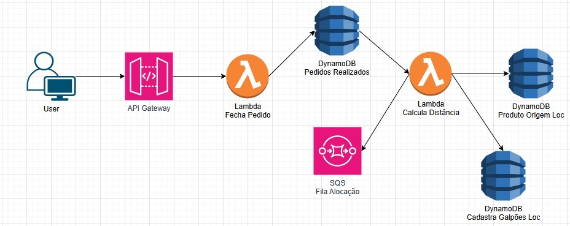

# API de Logística Serverless na AWS


Este projeto implementa uma API serverless para um sistema de logística. A API recebe pedidos contendo a geolocalização de um cliente e, de forma assíncrona, determina o centro de distribuição (galpão) mais próximo para otimizar a entrega.

Este projeto foi construído utilizando o **AWS Serverless Application Model (SAM)**.

---

## 🏛️ Arquitetura

O fluxo da aplicação segue a arquitetura abaixo:

1.  Um usuário (via `curl` ou front-end) envia um pedido `POST` para o **API Gateway**.
2.  O API Gateway dispara a Lambda **`FechaPedidoFunction`**.
3.  Esta Lambda valida os dados, salva o pedido com status `PENDENTE` no **DynamoDB (`PedidosRealizadosTable`)** e envia uma mensagem para a fila **SQS (`AlocacaoQueue`)**.
4.  A fila SQS serve como um buffer e invoca a Lambda **`CalculaDistanciaFunction`**.
5.  Esta Lambda lê a localização de todos os galpões cadastrados no **DynamoDB (`CadastraGalpoesLocTable`)**, calcula a distância euclidiana para encontrar o mais próximo e, por fim, atualiza o pedido na `PedidosRealizadosTable` com o `galpaoId` alocado e o status `ALOCADO`.


*(Nota: Você precisará adicionar a imagem da arquitetura em uma pasta `docs`)*

---

## 💻 Tecnologias Utilizadas

* **AWS SAM (Serverless Application Model):** Framework para definição da infraestrutura como código (IaC).
* **Amazon API Gateway:** Criação do endpoint REST para receber os pedidos.
* **AWS Lambda:** Execução da lógica de negócio em Python sem gerenciamento de servidores.
* **Amazon SQS (Simple Queue Service):** Desacoplamento de serviços e processamento assíncrono de pedidos.
* **Amazon DynamoDB:** Banco de dados NoSQL para persistência dos pedidos e galpões.
* **Python 3.11:** Linguagem de programação para as funções Lambda.

---

## 🚀 Começando

Siga os passos abaixo para implantar e executar esta aplicação em sua própria conta AWS.

### Pré-requisitos

* Conta na AWS com credenciais configuradas (AWS CLI)
* [AWS SAM CLI](https://docs.aws.amazon.com/serverless-application-model/latest/developerguide/serverless-sam-cli-install.html) instalado
* [Python 3.11](https://www.python.org/downloads/) instalado
* [Docker](https://www.docker.com/products/docker-desktop/) instalado e em execução

### Instalação e Deploy

1.  **Clone o repositório:**
    ```bash
    git clone [https://github.com/SEU-USUARIO/SEU-REPOSITORIO.git](https://github.com/SEU-USUARIO/SEU-REPOSITORIO.git)
    cd SEU-REPOSITORIO
    ```

2.  **Construa o projeto com SAM:**
    ```bash
    sam build
    ```

3.  **Implante o projeto na AWS:**
    O SAM fará perguntas sobre o nome da stack e as permissões IAM.
    ```bash
    sam deploy --guided
    ```
    * **Stack Name:** `app-logistica` (ou o nome que preferir)
    * Responda `Y` (sim) para as perguntas sobre criação de roles IAM e confirmação de deploy.

---

## 🧪 Testando a Aplicação

Após o deploy, a API estará no ar, mas a tabela de galpões estará vazia.

### 1. Cadastre os Galpões de Teste

Acesse o **Console da AWS** -> **DynamoDB** -> **Tabelas** e abra a sua tabela `app-logistica-CadastraGalpoesLocTable-XXXXX`.

Crie dois itens de teste (você pode usar a visualização de Formulário ou JSON):

**Galpão 1 (Vitória):**
```json
{
  "galpaoId": "g-vitoria",
  "localizacao": {
    "x": 10,
    "y": 15
  },
  "nome": "Galpão de Vitória"
}